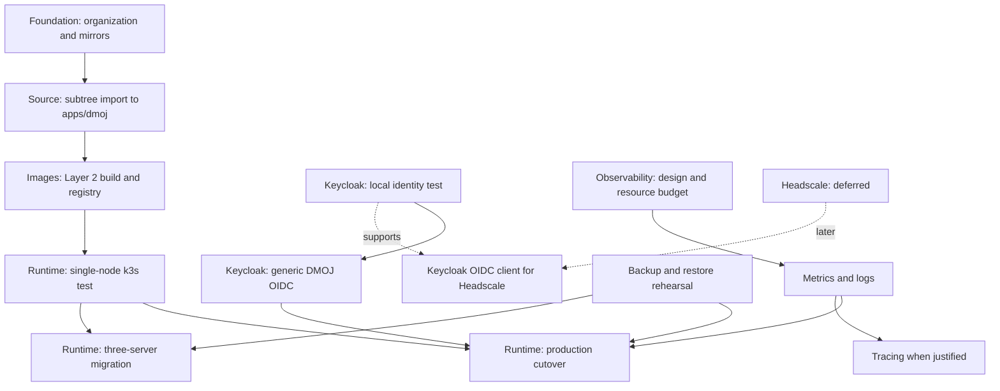

# Solo-Team Delivery Roadmap

Read [Platform Decisions](decisions.md) first. This is a high-level orientation tool; detailed tasks and command-level checks remain in the linked strategy documents.

## How To Use This Roadmap

- Work one active item at a time.
- An item becomes a separate commit only after its exit criteria pass.
- Items connected by an arrow depend on the preceding item. Unconnected items can be scheduled independently.
- Add future work as a new short ID, a dependency edge, an owner document, and entry/exit criteria.

## Dependency Graph



## Work Items

| ID | Goal | Depends on | Can proceed independently with | Owner document |
| --- | --- | --- | --- | --- |
| A | Create `mokla-platform` private organization and vendor mirrors | None | K0, O0, S0 | [Dependency Mirroring](dependency-mirroring.md) |
| B | Import reviewed DMOJ source into `apps/dmoj` using subtree | A | K0, O0, S0 | [Dependency Mirroring](dependency-mirroring.md) |
| C | Build and publish immutable Layer 2 images | B | K0, O0, S0 | [Image Build](image-build.md) |
| K0 | Run Keycloak and its dedicated MariaDB locally; prove OIDC discovery | None | A, B, O0, S0 | [Keycloak Plan](../keycloak/keycloak_dmoj_test_plan.md) |
| K1 | Integrate generic OIDC login with DMOJ and manual identity linking | K0 | O0, S0 | [Keycloak Plan](../keycloak/keycloak_dmoj_test_plan.md) |
| O0 | Choose observability storage, retention, alerts, and resource budget | None | A, B, K0, S0 | [Instrumentation](instrumentation.md) |
| O1 | Deploy Alloy, Loki, Prometheus, Grafana, exporters, and one alert route | D, O0 | K1, S0 | [k3s Runtime](k3s-runtime.md) |
| O2 | Add OpenTelemetry Collector and Tempo after a demonstrated tracing need | O1 | F | [Instrumentation](instrumentation.md) |
| S0 | Prove backups and restores for DMOJ MariaDB, Keycloak MariaDB, and required Redis state | None | A, B, K0, O0 | [k3s Runtime](k3s-runtime.md) |
| D | Deploy and validate a single-server k3s test cluster | C | K1, O0, S0 | [k3s Runtime](k3s-runtime.md) |
| E | Cut over public DMOJ to single-server k3s with planned downtime | D, K1, O1, S0 | H0 | [k3s Runtime](k3s-runtime.md) |
| F | Build a new three-server embedded-etcd cluster and migrate with planned downtime | D, S0 | O2, H0 | [k3s Runtime](k3s-runtime.md) |
| H0 | Evaluate Headscale only when a private-admin or private-registry need is active | None | All current work | [k3s Runtime](k3s-runtime.md) |

## Shared Entry Criteria

Start any implementation item only when:

- The intended outcome fits one work-item goal and has one owner document.
- The current branch/worktree is understood; unrelated changes are left untouched.
- The task has a bounded file scope and a manual validation command or procedure.
- Required credentials are available through ignored local configuration, never by committing secrets.
- Rollback is known for changes that affect data, ingress, identity, or production traffic.

## Shared Exit Criteria

Finish and commit an item only when:

- The owner document reflects the result and does not duplicate platform decisions.
- Configuration renders or syntax checks pass.
- The item-specific manual test passes and its outcome is recorded in the commit/PR notes.
- Existing affected workflows have a focused regression check.
- New images are pinned by digest and source dependencies by commit where applicable.
- No credentials, private keys, tokens, or generated runtime data are staged.
- The next dependent item has the information it needs to begin.

## High-Level Milestones

### Milestone 1: Reproducible Source and Local Identity

Complete A, B, K0, and S0. The team can rebuild source, test Keycloak locally, and recover external state before introducing k3s.

### Milestone 2: Immutable Test Runtime

Complete C, D, and O0. DMOJ runs on a disposable single-node k3s test namespace from published image digests.

### Milestone 3: Public Authenticated Service

Complete K1, O1, and E. Public DMOJ supports manually linked generic-OIDC users with basic metrics, logs, alerting, backup, and rollback.

### Milestone 4: Resilient Runtime

Complete F. A separate three-server cluster is rehearsed and cut over during a published maintenance window. O2 and H0/H1 remain optional follow-on work.

## Extension Template

Add new work in this format:

```text
ID: <short identifier>
Goal: <one outcome>
Depends on: <IDs or None>
Can run with: <IDs>
Owner document: <relative path>
Manual check: <one command or concise procedure>
Exit condition: <observable result>
```
