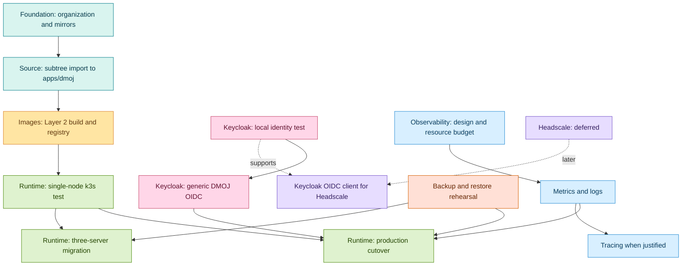

# Solo-Team Delivery Roadmap

Read [Platform Decisions](decisions.md) first. This is a high-level orientation tool; detailed tasks and command-level checks remain in the linked strategy documents.

## How To Use This Roadmap

- Work one active item at a time.
- An item becomes a separate commit only after its exit criteria pass.
- Items connected by an arrow depend on the preceding item. Unconnected items can be scheduled independently.
- Add future work as a new short ID, a dependency edge, an owner document, and entry/exit criteria.

## Effort Model

Effort is relative planning capacity, not a calendar commitment. One effort unit (EU) is roughly half a focused engineering day for a familiar, bounded change. Include implementation, manual validation, documentation, and a clean commit in the base estimate.

| Multiplier | Apply when the item includes |
| --- | --- |
| `1.0` | Documentation, known configuration, or a reversible isolated change |
| `1.25` | New external service, credentials, or CI integration |
| `1.5` | Cross-layer integration, persistent state, ingress, or a new operational workflow |
| `1.75` | Authentication, public traffic, irreversible data effects, or a production cutover |
| `2.0` | A cluster/state migration, multiple systems changing together, or an unproven recovery path |

Estimated effort is `base EU x multiplier`, rounded up. Treat estimates above 12 EU as a warning to split the work into smaller independently committable items before starting.

## Dependency Graph



## Work Items

Palette: foundation/source (teal), image build (amber), identity (pink), observability (blue), data safety (coral), runtime (green), and private networking (lavender).

<table border="1" cellpadding="8" cellspacing="0" style="border-collapse: collapse; border: 2px solid #31424a">
  <thead>
    <tr style="background-color: #31424a; color: #ffffff"><th>ID</th><th>Goal</th><th>Depends on</th><th>Base EU</th><th>Multiplier</th><th>Estimate</th><th>Can proceed independently with</th><th>Owner document</th></tr>
  </thead>
  <tbody>
    <tr style="background-color: #087e8b; color: #ffffff"><th colspan="8" align="left">Foundation and source</th></tr>
    <tr style="background-color: #d9f4ef"><td>A</td><td>[x] Create public <code>MoklaEducation</code> forks with controlled <code>prod</code> branches and baseline tags</td><td>None</td><td>3</td><td>1.25</td><td>4 EU</td><td>K0, O0, S0</td><td><a href="dependency-mirroring.md">Dependency Mirroring</a></td></tr>
    <tr style="background-color: #d9f4ef"><td>B</td><td>Import reviewed DMOJ source into <code>apps/dmoj</code> using subtree</td><td>A</td><td>5</td><td>1.5</td><td>8 EU</td><td>K0, O0, S0</td><td><a href="dependency-mirroring.md">Dependency Mirroring</a></td></tr>
    <tr style="background-color: #d9822b; color: #ffffff"><th colspan="8" align="left">Image build</th></tr>
    <tr style="background-color: #ffe5a3"><td>C</td><td>Build and publish immutable Layer 2 images</td><td>B</td><td>8</td><td>1.5</td><td>12 EU</td><td>K0, O0, S0</td><td><a href="image-build.md">Image Build</a></td></tr>
    <tr style="background-color: #c44569; color: #ffffff"><th colspan="8" align="left">Identity</th></tr>
    <tr style="background-color: #ffd6e8"><td>K0</td><td>Run Keycloak and its dedicated MariaDB locally; prove OIDC discovery</td><td>None</td><td>5</td><td>1.5</td><td>8 EU</td><td>A, B, O0, S0</td><td><a href="../keycloak/keycloak_dmoj_test_plan.md">Keycloak Plan</a></td></tr>
    <tr style="background-color: #ffd6e8"><td>K1</td><td>Integrate generic OIDC login with DMOJ and manual identity linking</td><td>K0</td><td>8</td><td>1.75</td><td>14 EU; split first</td><td>O0, S0</td><td><a href="../keycloak/keycloak_dmoj_test_plan.md">Keycloak Plan</a></td></tr>
    <tr style="background-color: #268bd2; color: #ffffff"><th colspan="8" align="left">Observability</th></tr>
    <tr style="background-color: #d8efff"><td>O0</td><td>Choose observability storage, retention, alerts, and resource budget</td><td>None</td><td>2</td><td>1.0</td><td>2 EU</td><td>A, B, K0, S0</td><td><a href="instrumentation.md">Instrumentation</a></td></tr>
    <tr style="background-color: #d8efff"><td>O1</td><td>Deploy Alloy, Loki, Prometheus, Grafana, exporters, and one alert route</td><td>D, O0</td><td>8</td><td>1.5</td><td>12 EU</td><td>K1, S0</td><td><a href="k3s-runtime.md">k3s Runtime</a></td></tr>
    <tr style="background-color: #d8efff"><td>O2</td><td>Add OpenTelemetry Collector and Tempo after a demonstrated tracing need</td><td>O1</td><td>5</td><td>1.5</td><td>8 EU</td><td>F</td><td><a href="instrumentation.md">Instrumentation</a></td></tr>
    <tr style="background-color: #d55e00; color: #ffffff"><th colspan="8" align="left">Data safety</th></tr>
    <tr style="background-color: #ffe0d6"><td>S0</td><td>Prove backups and restores for DMOJ MariaDB, Keycloak MariaDB, and required Redis state</td><td>None</td><td>5</td><td>1.5</td><td>8 EU</td><td>A, B, K0, O0</td><td><a href="k3s-runtime.md">k3s Runtime</a></td></tr>
    <tr style="background-color: #4f8a10; color: #ffffff"><th colspan="8" align="left">Runtime</th></tr>
    <tr style="background-color: #dff2cf"><td>D</td><td>Deploy and validate a single-server k3s test cluster</td><td>C</td><td>8</td><td>1.5</td><td>12 EU</td><td>K1, O0, S0</td><td><a href="k3s-runtime.md">k3s Runtime</a></td></tr>
    <tr style="background-color: #dff2cf"><td>E</td><td>Cut over public DMOJ to single-server k3s with planned downtime</td><td>D, K1, O1, S0</td><td>5</td><td>1.75</td><td>9 EU</td><td>H0</td><td><a href="k3s-runtime.md">k3s Runtime</a></td></tr>
    <tr style="background-color: #dff2cf"><td>F</td><td>Build a new three-server embedded-etcd cluster and migrate with planned downtime</td><td>D, S0</td><td>13</td><td>2.0</td><td>26 EU; split first</td><td>O2, H0</td><td><a href="k3s-runtime.md">k3s Runtime</a></td></tr>
    <tr style="background-color: #7654c8; color: #ffffff"><th colspan="8" align="left">Private networking</th></tr>
    <tr style="background-color: #e7ddff"><td>H0</td><td>Evaluate Headscale only when a private-admin or private-registry need is active</td><td>None</td><td>2</td><td>1.0</td><td>2 EU</td><td>All current work</td><td><a href="k3s-runtime.md">k3s Runtime</a></td></tr>
  </tbody>
</table>

## Shared Entry Criteria

Start any implementation item only when:

- The intended outcome fits one work-item goal and has one owner document.
- The current branch/worktree is understood; unrelated changes are left untouched.
- The task has a bounded file scope and a manual validation command or procedure.
- Required credentials are available through ignored local configuration, never by committing secrets.
- Rollback is known for changes that affect data, ingress, identity, or production traffic.

## Shared Exit Criteria

Finish and commit an item only when:

- The owner document reflects the result and does not duplicate platform decisions.
- Configuration renders or syntax checks pass.
- The item-specific manual test passes and its outcome is recorded in the commit/PR notes.
- Existing affected workflows have a focused regression check.
- New images are pinned by digest and source dependencies by commit where applicable.
- No credentials, private keys, tokens, or generated runtime data are staged.
- The next dependent item has the information it needs to begin.

## High-Level Milestones

### Milestone 1: Reproducible Source and Local Identity

Complete B, K0, and S0. A is complete: the public <code>MoklaEducation</code> forks,
controlled <code>prod</code> branches, and baseline tags exist. The team can rebuild
source, test Keycloak locally, and recover external state before introducing k3s.

### Milestone 2: Immutable Test Runtime

Complete C, D, and O0. DMOJ runs on a disposable single-node k3s test namespace from published image digests.

### Milestone 3: Public Authenticated Service

Complete K1, O1, and E. Public DMOJ supports manually linked generic-OIDC users with basic metrics, logs, alerting, backup, and rollback.

### Milestone 4: Resilient Runtime

Complete F. A separate three-server cluster is rehearsed and cut over during a published maintenance window. O2 and H0/H1 remain optional follow-on work.

## Extension Template

Add new work in this format:

```text
ID: <short identifier>
Goal: <one outcome>
Depends on: <IDs or None>
Can run with: <IDs>
Owner document: <relative path>
Manual check: <one command or concise procedure>
Exit condition: <observable result>
Base EU: <integer>
Multiplier: <1.0, 1.25, 1.5, 1.75, or 2.0>
```
