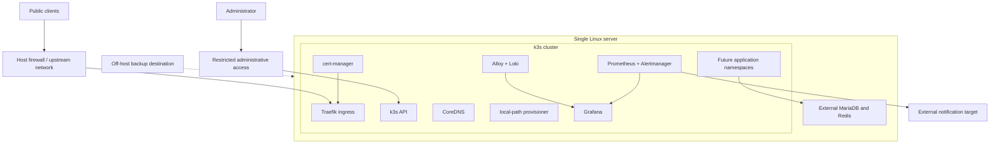

# k3s Cluster Blueprint

Status: proposed for agreement; no implementation is defined here.

## Purpose

Define a small, reliable, and repeatable k3s platform that one person can build,
operate, recover, and later extend with GitOps and CI/CD. The cluster is infrastructure
onto which application services will be deployed independently. This document does not
define DMOJ, Keycloak, or any other application workload.

This blueprint follows the accepted boundaries in
[Platform Decisions](../../docs/architecture/decisions.md) and the direction in
[k3s Runtime](../../docs/architecture/k3s-runtime.md). If this proposal changes an
accepted platform decision, update `decisions.md` before implementation.

## Outcomes

The first implementation must provide:

- A version-pinned, single-server k3s cluster that can be built from a clean supported
  Linux host without undocumented manual configuration.
- A repeatable automation entry point for install, validation, upgrade, backup, restore,
  and full rebuild.
- A secure default platform with ingress, certificate automation, metrics, logs,
  dashboards, and actionable alerting.
- Explicit resource, storage, retention, networking, and recovery policies suitable for
  a small number of sites operated by one person.
- A stable contract for future application deployments without coupling cluster
  provisioning to application releases.
- A documented migration path to a new three-server cluster if control-plane high
  availability becomes necessary.

## Scope

### In scope

- Host prerequisites and baseline operating-system configuration.
- Installation and lifecycle management of one k3s server.
- Kubernetes API access, node identity, networking, DNS, ingress, and local storage.
- Platform namespaces, RBAC, network-policy defaults, and secret-delivery boundaries.
- `cert-manager` and certificate issuer configuration.
- Prometheus, Alertmanager, Grafana, Loki, and Grafana Alloy.
- Cluster configuration backup, restore, rebuild, upgrade, and validation procedures.
- Interfaces that future GitOps and application delivery systems will consume.

### Out of scope

- Definitions, configuration, or rollout rules for application services.
- Moving MariaDB or Redis into Kubernetes.
- A highly available control plane in the initial implementation.
- Distributed storage or automatic failover across machines.
- Tempo and application tracing until metrics and logs demonstrate a concrete need.
- Selection or implementation of the future GitOps and CI/CD products.
- Production installation or migration as part of agreeing this blueprint.

## Architecture Principles

1. **Declarative and reproducible:** all non-secret desired state is version-controlled.
   Running the automation twice must converge without damaging a healthy cluster.
2. **Replaceable host:** recovery must not depend on remembering changes made directly on
   the server. A replacement host can be brought to the documented state from source,
   backups, and externally held secrets.
3. **Pinned inputs:** pin the k3s release, system dependencies, Helm charts, and deployed
   images. Upgrades are explicit changes, not unattended version drift.
4. **Layer separation:** node bootstrap, cluster platform services, and application
   services have separate inventories, configuration, validation, and release cycles.
5. **Small-system bias:** prefer boring, supported defaults and single-replica platform
   services where high availability would add more operational risk than value.
6. **Recovery over illusion:** a single server has unavoidable downtime. Fast, rehearsed
   restore and rebuild are the initial resilience strategy.
7. **Secure by default:** minimum access, private operational endpoints, encrypted
   transport, protected secrets, and no sensitive observability data.
8. **Observable operations:** every critical platform component has health signals,
   bounded retention, capacity visibility, and an actionable alert route.

## Initial Topology

### Fixed initial choices

| Concern | Initial choice |
| --- | --- |
| Control plane | One k3s server |
| Datastore | k3s default SQLite |
| Ingress controller | Bundled Traefik |
| Cluster DNS | Bundled CoreDNS |
| Persistent volumes | Bundled local-path provisioner |
| Service load balancer | Bundled ServiceLB unless the network design requires another choice |
| Application databases | External to Kubernetes |
| Workload artifacts | Immutable OCI images deployed by digest |
| Availability model | Planned downtime with tested rebuild and restore |

## Automation Contract

The preferred implementation model is Ansible for host and cluster orchestration, with
small shell entry points for a consistent operator interface. Kubernetes resources should
remain declarative YAML managed through Kustomize or pinned Helm releases. The exact file
layout is an implementation decision, but the responsibilities must remain separate.

### Required automation stages

1. **Preflight:** verify supported OS and architecture, CPU, memory, disk, DNS, time sync,
   required ports, outbound access, and absence of conflicting Kubernetes components.
2. **Host baseline:** configure time sync, required kernel modules/sysctls, firewall rules,
   package prerequisites, storage paths, and a restricted automation account.
3. **k3s bootstrap:** install the pinned release with an explicit configuration file,
   securely obtain the cluster token, and retrieve a least-privilege kubeconfig.
4. **Platform bootstrap:** create namespaces and policies, then install certificate and
   observability add-ons in dependency order.
5. **Validation:** run idempotence, node, DNS, storage, ingress, certificate, metrics,
   logs, alert-delivery, and backup checks.
6. **Lifecycle:** expose explicit upgrade, rollback, backup, restore, and uninstall/rebuild
   workflows. Destructive workflows require confirmation and must never be implicit.

### Configuration classes

| Class | Examples | Storage rule |
| --- | --- | --- |
| Public desired state | k3s version, chart versions, namespaces, resource budgets | Git |
| Environment inventory | node address, public names, storage paths | Git when non-sensitive |
| Secrets | tokens, passwords, private keys, issuer credentials | Encrypted secret store, never plaintext Git |
| Runtime state | SQLite database, persistent volumes, generated certificates | Host storage plus off-host backup |
| Evidence | validation and restore-test results | CI artifacts or operational records |

All automation must support a check/render mode that does not mutate the host or cluster.
Logs must redact secret values.

## Platform Requirements

### Host and k3s lifecycle

- Define and enforce a supported Linux distribution and release range.
- Pin k3s by exact version and checksum; disable unattended k3s upgrades initially.
- Use a stable hostname, static or reserved address, working forward/reverse DNS where
  available, and synchronized time.
- Reserve capacity for the operating system and cluster services before scheduling apps.
- Define minimum free-disk thresholds and prevent unbounded container-image and log use.
- Capture the effective k3s configuration and installed component versions in validation
  output without exposing credentials.
- Prove that a second automation run reports no unintended changes.

### Networking and access

- Document the pod and service CIDRs before installation and avoid overlap with host,
  home, cloud, VPN, and future multi-node networks.
- Expose only required public ingress ports. Restrict SSH and Kubernetes API access to
  approved administrative networks or a private access path.
- Keep Grafana, Prometheus, Alertmanager, Loki, and other operational UIs private by
  default.
- Establish default-deny ingress and egress policies for application and platform
  namespaces, adding explicit flows as workloads are introduced.
- Confirm that the chosen k3s network-policy controller is enabled and that policies are
  exercised by tests.
- Record all externally allocated ports, including any future non-HTTP application ports,
  in one inventory.
- Treat private networking such as Headscale as a separate add-on, not a dependency for
  cluster-internal traffic.

### Ingress and certificates

- Use Traefik as the initial ingress controller and configure trusted proxy behavior,
  access logs, request limits, and TLS defaults explicitly.
- Use `cert-manager` with a dedicated ClusterIssuer or Issuer per trust boundary.
- Use ACME HTTP-01 for suitable public names or DNS-01 where ingress cannot be public.
- Keep internal services private; do not expose them only to obtain certificates.
- Alert before certificate expiration and test automatic renewal in a non-production
  issuer environment before enabling production issuance.
- Back up issuer configuration and account references; private keys remain secret data.

### Storage and data protection

- Use local-path volumes only for workloads whose single-node failure behavior is
  understood and accepted.
- Define storage capacity, filesystem, mount points, ownership, and disk-health checks as
  host configuration rather than ad hoc pod configuration.
- Back up the k3s SQLite datastore, server token, cluster configuration, certificate
  state, and required persistent volumes to storage outside the server.
- Backups must be encrypted, integrity-checked, retained by policy, and monitored for
  freshness and failure.
- A restore is not considered supported until it has been rehearsed onto a clean host and
  the restored platform passes validation.
- External databases and Redis keep their own backup and restore procedures outside this
  cluster blueprint; cluster recovery must preserve their connection contract.

### Observability

The baseline observability stack is a Layer 4 platform add-on in a dedicated namespace:

| Component | Required initial role |
| --- | --- |
| Prometheus | Cluster, node, Kubernetes, ingress, certificate, and platform metrics |
| Alertmanager | Route actionable alerts to one externally tested notification target |
| Grafana | Private dashboards; configuration is reproducible and backed up |
| Grafana Alloy | Collect node, Kubernetes, ingress, and container logs |
| Loki | Single-replica log storage with short, explicit retention |
| Tempo | Deferred until distributed tracing has a demonstrated use case |

The initial dashboard and alert set must cover node readiness, CPU and memory pressure,
filesystem capacity, certificate expiry, failed backups, pod crash loops, persistent
volume usage, ingress availability, monitoring blind spots, and alert-route health.

Use 15-30 second metric scrape intervals initially. Set explicit requests, limits,
retention periods, and storage quotas for every observability component. Never collect
credentials, tokens, request bodies, or high-cardinality personal identifiers. Monitoring
must not consume the capacity reserved for application workloads.

### Security and secrets

- Use least-privilege RBAC and separate human, automation, and workload identities.
- Do not share the server administrator kubeconfig with deployment automation.
- Define how encrypted secrets reach a fresh cluster before application deployment begins.
  SOPS with age is the preferred lightweight starting point; the final choice remains an
  agreement item.
- Protect and rotate the k3s server token, kubeconfigs, ACME credentials, backup keys, and
  observability credentials.
- Run platform workloads as non-root with restricted security contexts where supported.
- Add image vulnerability scanning and admission policy later without making the first
  cluster depend on an unproven policy stack.
- Record administrative and deployment changes through Git history and automation logs.

### Resource management

- Establish a measured host capacity budget before selecting observability retention.
- Every add-on must declare CPU/memory requests and limits and persistent-storage needs.
- Reserve headroom for upgrades, rescheduling, image extraction, and transient spikes.
- Define namespace quotas and default limits before onboarding application workloads.
- Set an explicit threshold at which the operator must add capacity or reduce retention.

## Reliability and Recovery Targets

Exact values require agreement before implementation. The first release must record:

| Target | Proposed initial value |
| --- | --- |
| Cluster rebuild time objective | 4 hours from a prepared clean host |
| Cluster configuration recovery point | Last successful daily backup |
| Platform persistent-data recovery point | 24 hours maximum |
| Backup schedule | Daily, plus before every upgrade or production platform change |
| Restore rehearsal | Quarterly and before first production cutover |
| Planned maintenance | Allowed with advance notice |
| Control-plane failover | None on the single-server cluster |

The rebuild runbook must distinguish restoring the existing cluster identity from creating
a new cluster and redeploying desired state. Both paths require a validation report.

## Upgrade Policy

- Upgrade one k3s minor version at a time unless the supported upgrade path says otherwise.
- Test the exact change against a disposable or test cluster before production.
- Take and verify a pre-upgrade backup and retain the previous k3s installer and config.
- Upgrade platform add-ons independently in dependency-aware changes.
- Define a rollback or rebuild decision point before starting each upgrade.
- Run the full platform acceptance checks after every k3s or add-on upgrade.

## Future GitOps and CI/CD Contract

The initial automation must leave a clean handoff for later GitOps without requiring it:

- Git is the source of truth for non-secret cluster and add-on desired state.
- Bootstrap automation owns hosts, k3s installation, and the minimum components needed to
  hand control to a future GitOps reconciler.
- A future GitOps controller owns platform and application Kubernetes resources after
  bootstrap; ownership must not overlap with Ansible.
- Application repositories or directories publish immutable image digests and propose
  deployment-state changes. They do not administer nodes or the control plane.
- Promotion between test and production is an explicit reviewed change with health checks
  and rollback to the prior digest.
- CI may render, lint, scan, and test desired state. Production reconciliation credentials
  remain inside the cluster rather than in a general-purpose CI runner where possible.

Selection of Flux versus Argo CD, CI provider, promotion workflow, and image automation is
deferred until the base cluster is proven repeatable.

## Delivery Stages

These are architecture gates, not implementation instructions:

1. **Decision closure:** resolve the open decisions below and record exact reliability and
   capacity targets.
2. **Automation skeleton:** define inventory, configuration schema, secret inputs, and
   non-mutating preflight/check interfaces.
3. **Base cluster:** automate host baseline and pinned single-server k3s installation.
4. **Platform services:** add networking policies, certificate management, observability,
   alerting, and backup in independently reversible changes.
5. **Recovery proof:** rebuild a clean test host and restore platform state using only the
   repository, documented secret inputs, and backups.
6. **Application-ready gate:** publish the cluster interface and acceptance evidence so
   application services can be designed separately.

## Application-Ready Acceptance Criteria

The cluster is ready to receive application definitions only when all of the following are
true:

- A clean supported host can be provisioned by one documented command or workflow.
- Re-running automation is idempotent and reports no unexplained drift.
- Kubernetes API, node, CoreDNS, storage provisioning, ingress, and network-policy tests
  pass.
- A disposable test hostname obtains and renews a certificate through `cert-manager`.
- Prometheus receives platform targets, logs are queryable in Loki, Grafana dashboards
  load, and a controlled alert reaches the operator.
- Backup freshness is monitored and a clean-host restore rehearsal meets the agreed RTO
  and RPO.
- Public and administrative exposure matches the port and access inventory.
- Resource requests, limits, quotas, retention, and remaining application capacity are
  documented from measured usage.
- No plaintext secret or generated runtime state exists in Git.
- The exact k3s, chart, and image versions are recorded and reproducible.
- Upgrade and failed-change rollback procedures have each been exercised once.

## Open Decisions Before Implementation

1. Target Linux distribution/version and minimum server CPU, memory, and storage.
2. Physical, home-hosted, VPS, or cloud placement and the resulting public IP/firewall
   model.
3. Public and private DNS zones and whether ACME uses HTTP-01 or DNS-01.
4. Administrative access path: restricted public IPs, WireGuard/Tailscale, or later
   Headscale.
5. Off-host backup destination, retention, encryption-key custody, and proposed RPO/RTO.
6. Secret delivery: SOPS with age, an external secret manager, or another supported model.
7. Initial observability storage budget, log retention, and alert destination.
8. Whether bundled ServiceLB is sufficient for the host network.
9. Whether a disposable second environment is a VM on the same hardware or a separate
   host for upgrade and recovery rehearsals.
10. Whether the proposed Ansible plus thin-shell-wrapper automation model is accepted.

## Expansion Boundary

Adding k3s agent nodes later can provide application capacity but does not make the
control plane or local storage highly available. Do not add another server to the SQLite
cluster. If control-plane resilience becomes required, build a separate three-server k3s
cluster with embedded etcd, validate it, and migrate during planned downtime. That future
architecture must separately define API/ingress load balancing, failure domains, and
multi-node storage before implementation.