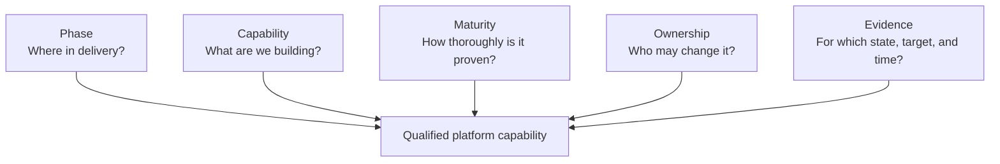
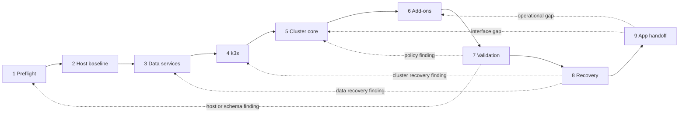
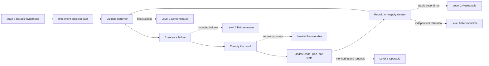
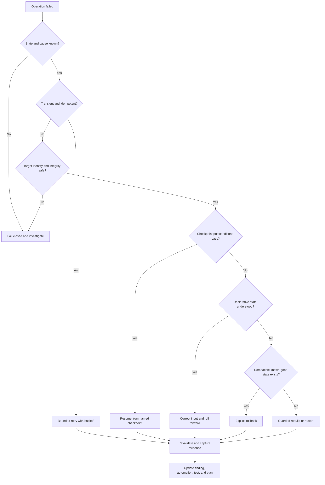
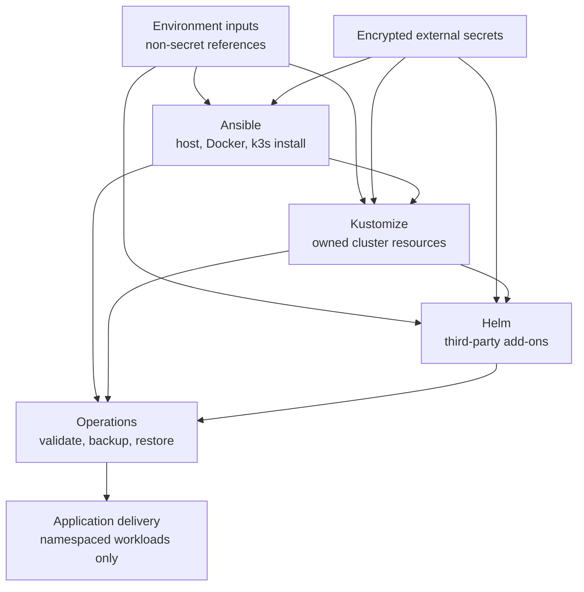
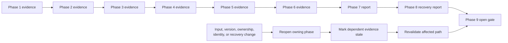
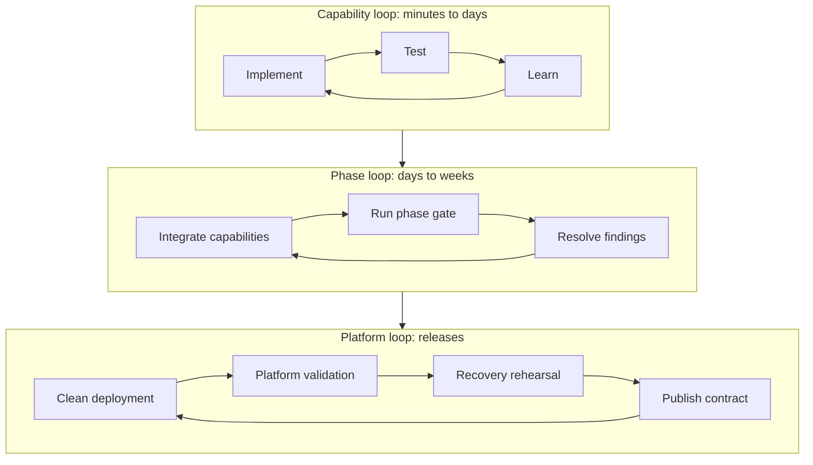

# Strategy Visualizations

Status: visual companion to the deployment and evolution strategies.

## How to Read the Strategy

The strategy is not one staircase and not one maturity score for the whole platform. It
has five related dimensions:

- **Phase** provides dependency order and a completion gate.
- **Capability** is the small unit that is implemented and tested.
- **Maturity** records the depth of proof for that capability.
- **Ownership** prevents two tools or teams from controlling the same state.
- **Evidence** makes a result valid only for exact inputs, versions, target, and time.

A statement such as “Phase 6 is complete” therefore means that every required Phase 6
capability reached its required maturity, stayed within its ownership boundary, and has
current evidence. It does not mean every platform capability has the same maturity.

## Phase Flow with Feedback

The main delivery direction is left to right. Dashed arrows show expected learning loops,
not exceptional project failure.

When a later phase exposes an earlier defect, reopen the owning phase, update its
automation and tests, invalidate affected evidence, and rerun only the dependent gates.
Do not continue forward with a known false assumption.

## Capability Maturity Spiral

Each capability repeatedly travels around the same learning loop. The loop becomes a
spiral because each pass should retain more automation, evidence, and operational
knowledge than the previous pass.

Maturity levels are evidence labels, not time estimates. A backup job may be repeatable
at Level 2 while its restore capability remains only demonstrated at Level 1. Track the
lower defensible level until the missing behavior is proven.

## Capability Board

Use this matrix as the main implementation dashboard. One row represents one capability,
not an entire phase.

| Capability | Owner | Introduced | Current maturity | Required at next gate | Evidence | Main blocker |
| --- | --- | --- | --- | --- | --- | --- |
| Host firewall | Ansible host baseline | Phase 2 | Record during implementation | Phase 2 acceptance | Evidence ID | Finding ID or none |
| MariaDB restore | Host data-service operations | Phase 3 | Record during implementation | Phase 3 isolated restore | Evidence ID | Finding ID or none |
| k3s state recovery | Host/k3s recovery | Phase 4 | Record during implementation | Phase 8 clean restore | Evidence ID | Finding ID or none |
| Default-deny policy | Kustomize cluster core | Phase 5 | Record during implementation | Phase 5 enforcement | Evidence ID | Finding ID or none |
| Certificate renewal | Helm add-on plus owned resources | Phase 6 | Record during implementation | Phase 6 or bounded exception | Evidence ID | Finding ID or none |
| Alert delivery | Helm add-on plus owned rules | Phase 6 | Record during implementation | Phase 6 end-to-end test | Evidence ID | Finding ID or none |

Extend the board as capabilities are introduced. Keep evidence references and findings in
the board, but keep credentials and verbose logs in their approved external locations.

## Failure Routing

This decision path keeps “try it again” from becoming the default response to every
failure.

Authentication, authorization, integrity, policy, identity, destructive-operation, and
unknown-state failures bypass retry and go to investigation or guarded recovery.

## Ownership Boundaries

Arrows show dependency or consumption, not shared ownership. Ansible may invoke a
Kustomize or Helm workflow, but it does not become owner of the resulting Kubernetes
objects. Future GitOps adoption replaces the direct Kustomize/Helm reconciliation owner;
it does not run concurrently as a second owner.

## Evidence Dependency and Invalidation

Evidence is a dependency graph, not a permanent certificate.

A change does not always require rerunning every phase. Start at the phase that owns the
changed assumption, identify consumers of its contract, and rerun that dependency path.
A cluster identity or recovery-authority change usually has broad impact; a dashboard
wording change usually does not.

## Three Operating Loops

The overall strategy can be remembered as three nested loops:

- The **capability loop** improves one behavior quickly.
- The **phase loop** proves that related capabilities work together.
- The **platform loop** proves clean deployment, operations, recovery, and consumer
  contracts as one system.

The loops continue after initial application readiness for upgrades, capacity changes,
security improvements, and eventual GitOps adoption.

## Practical Reading Order

When planning work, read the diagrams in this order:

1. Use the phase flow to choose the current delivery boundary.
2. Use the capability board to choose one small owned behavior.
3. Use the maturity spiral to choose the next missing proof.
4. Use failure routing when a check fails.
5. Use the evidence graph to determine what must be revalidated.
6. Use the ownership diagram before changing tools or responsibility.

This keeps iteration deliberate: move forward when evidence supports it, loop locally
when learning is contained, and reopen earlier phases when a foundational assumption
changes.